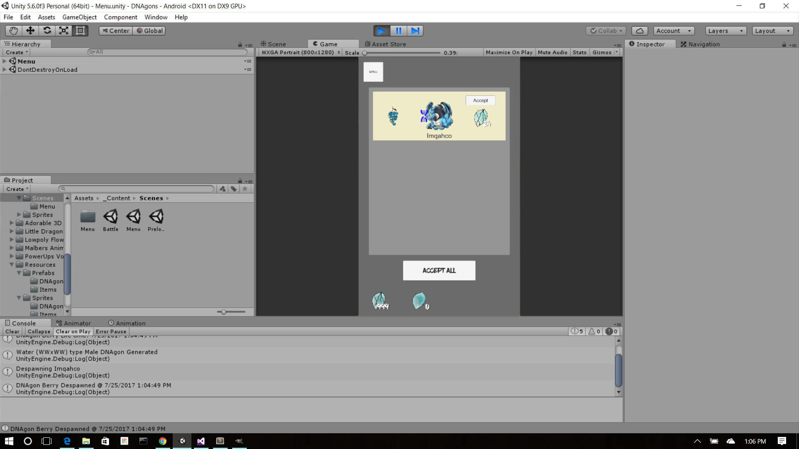
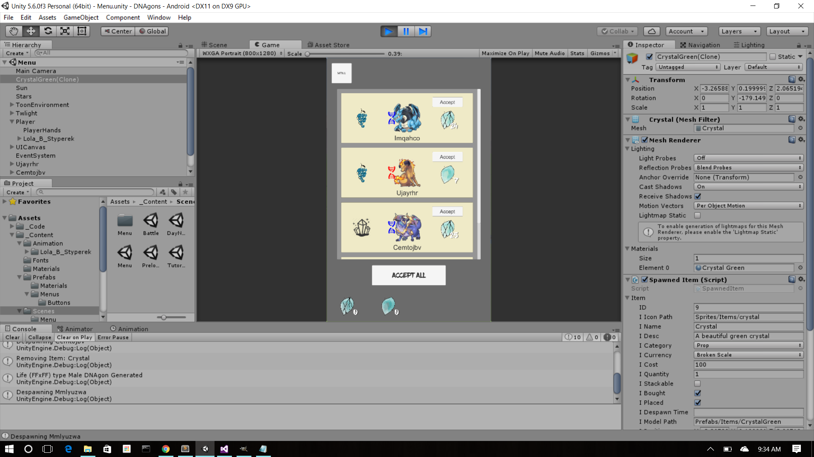
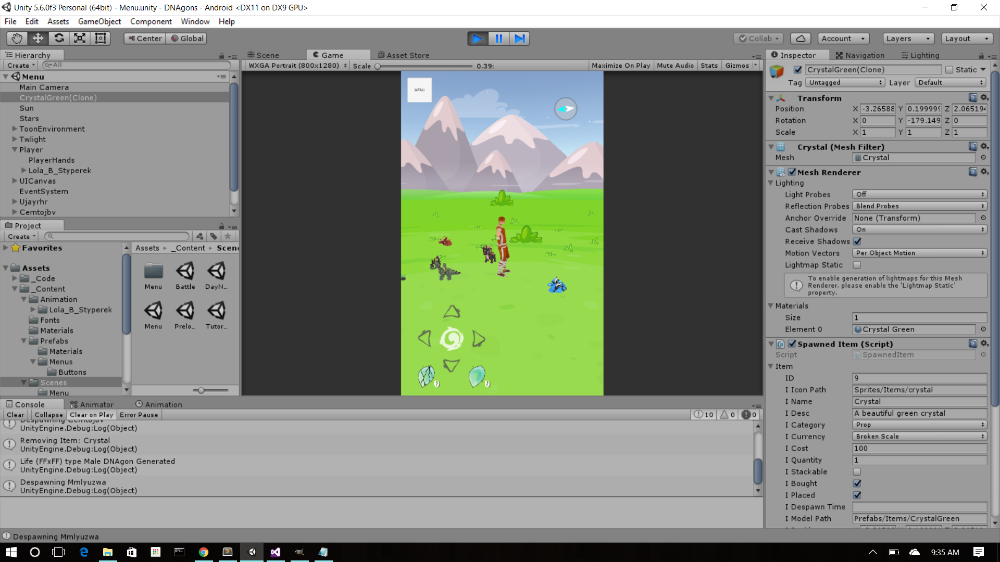
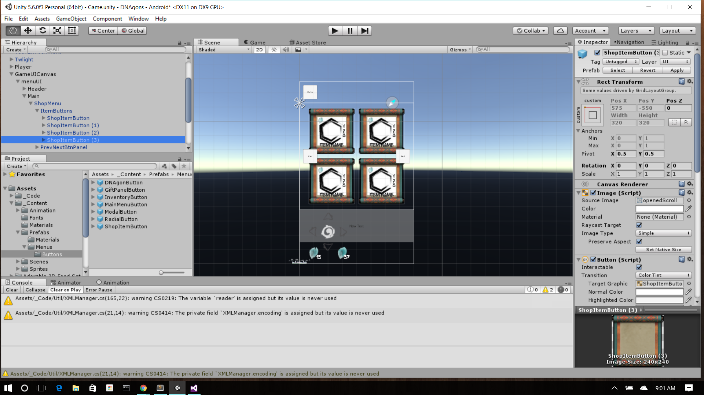

# DNAgons
A mobile game build with Unity

*Disclosure Most images currently in the game will need to be re-done for production. 

TODO: Add : Music, sound effects, sumi-e art and 3D models, a secure database solution with login, website, cash shop items, and code polishing. 

Launch Features :

	* A 3D mobile game with a Sumi-e / Ukiyo-e art style
	* 3D customizable backyard
		- players can buy items from the shop and place the items in their yard get DNAgons to visit our dimension.
		- take care though, these items will on occasion bring in predators that will scare away your DNAgons until you defeat it.
	* 'Take a photo' (neko atsume) will paint a scroll of your DNAgon visitors.
		- Player just swipes finger back and forth on scroll to simulate painting the DNAgon 
	* Capture DNAgons with Capture Cubes. There are 8 starter DNAgon types (gen 1 has 64 combinations)
	* Companion / Champion system allows players to choose one of their captured DNAgons to partner with
		- Players companion will follow the player around their yard/world
	* DNAgons that visit can leave broken or intact scales and very rarely an egg
		- Eggs are usually gifted to the player by breeding captured DNAgons
		- Players can walk or wait (2 kms/days, 5 5km/days, or 10 kms/days) to incubate an egg
	* DNAgon breeding (Family tree data structure) needed for tracking inbreeding
		- Create new DNAgons from your captured DNAgons, but be careful of inbreeding!
	* Follows day / night cycle
		- night increases chance of finding different DNAgons but increases chance of spawning predators.
	* Character creation (w selfie feature)
		- allow user to take a selfie and then turns the photo into a sumi-e style character

Future Features :

	* Real life weather updates (If it's raining in your area it's raining in the game)
	* Online status for PvP
		- while walking players can battle each other with their champion DNAgon (only 1v1)
	* Party system so other players can visit your backyard (your personal DNAgon breeding/training grounds)
	* VR Mode

Competing &&|| similar games : 

	* Dragon City (Dragon creatures), Okami (art style), Pokemon GO (Egg hatching, Creature collecting), DragonVale Dragon Mania Legends, Niche (creature breeding), Neko Atsume

Difference : 

	*The player has an avatar they can move around the 3D world and interact with their dragons.
	- i.e. : If the player sits by the pond a DNAgon with a high trust level will walk up to them and want to play.
	- Predators can kill your DNAgons if you dont keep your yard safe.
		-i.e player logs in to a message that says "While you were away, predators have broken your fence, repair it ASAP to keep your DNAgons safe."

--PGC--

*There are 64 types in Gen 1. They are made from different combinations of these basic types:

 	Name:		Base Color:	Genotype:
	- Flame, 	Red		FFxFF
    	- Water,	Blue		WWxWW
    	- Life,		Green		LLxLL
    	- Sky,		Cyan		CCxCC
    	- Rock,		Grey		RRxRR
    	- Twilight,	Black		DDxDD
    	- Solar,	Gold		SSxSS
    	- Crystal	Iridescent	CCxCC

From these others are created:

	- Steam		Purple		FFxWW low chance from Water and Flame breeding
	- Water		Blue w/ Red pat	WfxWf (because water beats flame)
	- Flame		Red w/ Blue pat FwxFw (Flame with water resistance) low chance

*Patterns/Marking are Procedurally generated and glow at night

DNAgons can have : 

	- 0 to 7 pair of eyes
	- 0 to 3 pair of ears
	- 0 to 2 pair of arms
	- 0 to 4 pair of wings
	- stub to extremely long tail
	- Feather, scales, skin, spikes, fur, and or armor like plates
	- Horns (antlers, antenna, fin-like appendages)
	- Claws or not
	- Deer like legs w/ a uni-toe or 2 to 5 fingers/toes
	- have 5 different 3D models based on their age.
		Egg,
    		Hatchling,
    		Young,
    		Adult,
    		Elder,
    		Ancient
		
In-breed DNAgons have defects like:

	- Overbite
	- Shortened limbs
	- Crooked / Lopsided features
	- Growth issues
	- Genetic disease
	- more to come...

